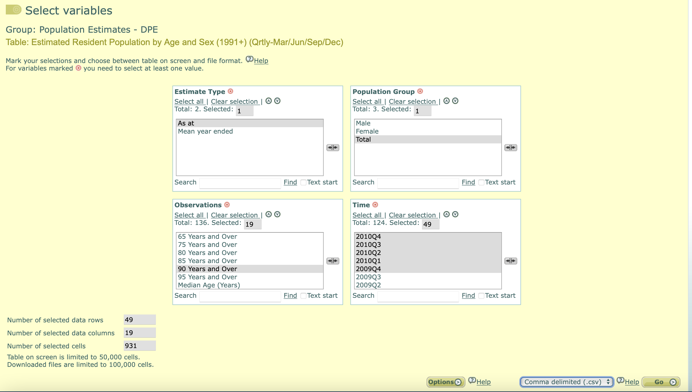
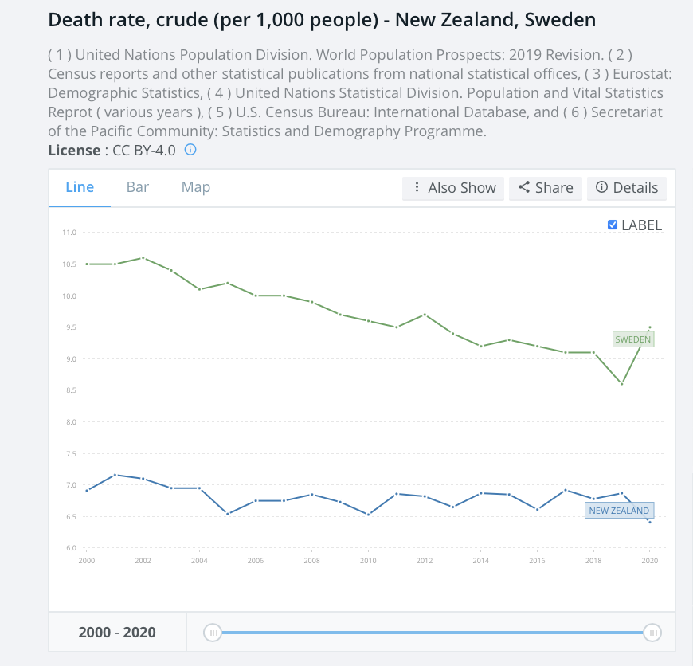

```{r setup, include=FALSE}
knitr::opts_chunk$set(echo = TRUE, fig.width=9.877, fig.height=5.556)
```

```{r libraries, include=FALSE}
library(knitr)
library(dplyr)
library(lubridate)
library(stringr)
library(tidyr)
library(scales)
library(ggplot2)
library(ggthemes)
```

```{r}
  theme_davidish <- function(){
    theme_minimal() %+replace% 
      theme(panel.grid = element_blank(),
            axis.line.x = element_line(size=0.1),
            axis.line.y = element_line(size=0.1),
            axis.ticks = element_line(size=0.2),
            strip.background = element_rect(fill= "#FFFFFF", colour="#EFEFEF"),
            strip.placement = "inside",
            panel.background = element_rect(fill = "#FFFFFF", colour = "#FFFFFF"),
            panel.spacing = unit(1, "lines"),
            plot.background = element_rect(fill = "#FCFCFC"),
            plot.caption.position = "plot",
            plot.margin = margin(0.1, 0.1, 0.1, 0.1, "cm"))
  }

```


This is working through an age stratified analysis of New Zealand excess mortality (and by implication, non-excess as well).

To be clear to the reader, this is not deaths. This is focusing on number of deaths divided by number of people. As deaths are limited by the number of alive people, you get innaccurate results if the number of people change. New Zealand's population increased by 8.0% from 2015 to 2019, the UK 2.6%, USA 2.4%, Denmark 3.1%. Such big differences in growth throw out comparison for New Zealand over time as much as they throw out comparisons between countries.

Age stratified mortality rate is better than a crude (total population) rate, as it accounts for changes in the age (risk) balance over time. In the public data weekly deaths the ages divisions are 0-29, 30-59, 60-79, 80 and over. So the plan is to make the more the population data match those divisions.


## Data

Weekly deaths by age come from Stats NZ Covid Data portal downloaded via the Stats NZ Open Data API. See https://www.stats.govt.nz/experimental/covid-19-data-portal

I saved the death data locally as NZ_weekly_deaths.csv. In using this data I would note the caveat that the very latest week, in particular, of this (provisional) data can be subject to revision when the data is next updated.

The population for each quarter comes from Infoshare at Stats NZ, https://infoshare.stats.govt.nz choosing Population > Population Estimates - DPE. The specific options chosen were:

* Estimate Type: As at
* Population Group: Total
* Observations: All five year intervals from 0-4 Years to 85-89 Years and 90 Years and Over
* Time: Latest Quarter (2021Q4) to 2009Q4 inclusive


```{r out.width="60%"}
 
```

I also changed the submission setting at the bottom of the form from Table on screen to 
Comma delimited (.csv), downloaded the file and saved it locally.

```{r}
weekly_deaths <- read.csv("NZ_weekly_deaths.csv") %>%
  mutate(Period = ymd(Period))
quarterly_pop <- read.csv("DPE403901_20220429_062743_16.csv", skip=3) %>%
  filter(!is.na(X0.4.Years)) %>%
  gather(key="age_set", value="population", -1) %>%
  separate(X., into=c("Yr", "Qr"), sep ="Q", convert = TRUE) %>%
  mutate(Period = ceiling_date(ymd(paste(Yr,Qr*3,1)), unit="quarter") - days(1),
         Label1 = case_when(age_set == "X0.4.Years" ~ "Under 30",
                            age_set == "X5.9.Years" ~ "Under 30",
                            age_set == "X10.14.Years" ~ "Under 30",
                            age_set == "X15.19.Years" ~ "Under 30",
                            age_set == "X20.24.Years" ~ "Under 30",
                            age_set == "X25.29.Years" ~ "Under 30",
                            age_set == "X30.34.Years" ~ "30 to 59",
                            age_set == "X35.39.Years" ~ "30 to 59",
                            age_set == "X40.44.Years" ~ "30 to 59",
                            age_set == "X45.49.Years" ~ "30 to 59",
                            age_set == "X50.54.Years" ~ "30 to 59",
                            age_set == "X55.59.Years" ~ "30 to 59",
                            age_set == "X60.64.Years" ~ "60 to 79",
                            age_set == "X65.69.Years" ~ "60 to 79",
                            age_set == "X70.74.Years" ~ "60 to 79",
                            age_set == "X75.79.Years" ~ "60 to 79",
                            age_set == "X80.84.Years" ~ "80 and over",
                            age_set == "X85.89.Years" ~ "80 and over",
                            age_set == "X90.Years.and.Over" ~ "80 and over"),
         Label1 = factor(Label1, levels=c("Under 30", "30 to 59", 
                                          "60 to 79", "80 and over"))) %>%
  filter(!is.na(age_set))
```

## Sense checking input
Just checking weekly deaths has 1 entry per week per age group, and population has 1 entry per quarter per age group.

```{r}
weekly_deaths %>% count(Period, Label1) %>% filter(n > 1) %>% nrow()
quarterly_pop %>% count(Period, age_set) %>% filter(n > 1) %>% nrow()
```
and there are no non-one entries, so all is good there.

## The numerator

For creating mortality rates, we divide the number of deaths by the population. But the quarterly populations are not yet available for this time period, so we are going to have to estimate what the values for 2022 quarter 1 (due out May 16th) and 2022 quarter 2 (due 3 months later) are.

So a good plan is to explore how population has changed to date.

```{r}
q_pop <- read.csv("DPE403901_20220429_062743_16.csv", skip=3) %>%
  filter(!is.na(X0.4.Years)) %>%
  gather(key="age_set", value="population", -1) %>%
  separate(X., into=c("Yr", "Qr"), sep ="Q", convert = TRUE) %>%
  mutate(Period = ceiling_date(ymd(paste(Yr,Qr*3,1)), unit="quarter") - days(1),
         age_group = case_when(str_detect(age_set, fixed("X0.4.")) ~ "00 to 04",
                               str_detect(age_set, fixed("X5.9.")) ~ "05 to 09",
                               str_detect(age_set, fixed("X10.14.")) ~ "10 to 14",
                               str_detect(age_set, fixed("X15.19.")) ~ "15 to 19",
                               str_detect(age_set, fixed("X20.24.")) ~ "20 to 24",
                               str_detect(age_set, fixed("X25.29.")) ~ "25 to 29",
                               str_detect(age_set, fixed("X30.34.")) ~ "30 to 34",
                               str_detect(age_set, fixed("X35.39.")) ~ "35 to 39",
                               str_detect(age_set, fixed("X40.44.")) ~ "40 to 44",
                               str_detect(age_set, fixed("X45.49.")) ~ "45 to 49",
                               str_detect(age_set, fixed("X50.54.")) ~ "50 to 54",
                               str_detect(age_set, fixed("X55.59.")) ~ "55 to 59",
                               str_detect(age_set, fixed("X60.64.")) ~ "60 to 64",
                               str_detect(age_set, fixed("X65.69.")) ~ "65 to 69",
                               str_detect(age_set, fixed("X70.74.")) ~ "70 to 74",
                               str_detect(age_set, fixed("X75.79.")) ~ "75 to 79",
                               str_detect(age_set, fixed("X80.84.")) ~ "80 to 84",
                               str_detect(age_set, fixed("X85.89.")) ~ "85 to 89",
                               str_detect(age_set, fixed("X90.")) ~ "90 and over")
         )
ggplot(q_pop, aes(x=Period, y=population)) +
    geom_line() + 
  facet_wrap(~age_group, ncol=4, scales = "free_y") +
  scale_colour_colorblind() + theme_minimal() +
  scale_y_continuous(labels = comma_format()) +
  labs(y="Quarterly population\n", "\nQuarter",
       title="Quarterly population by 5 year age groups") +
  theme_davidish()
```
Because the subcomponent age groups have seen, in some cases, dramatic changes in direction in the recent past, to estimate March and May 2022 it seems best to extend from the last 3 entries in 2021. 

But until making this graph I really had not appreciated how much the age distribution had changed in 2020-2021. Both older people not dying and younger no new working holiday etc arriving as existing ones return to other countries contribute to a drastic shift older in the data. Using death or population numbers from pre-2020 without building this change into the analysis in some manner (such as I am doing in this) is going to throw things out by a long way.

```{r}
new_pop <- q_pop %>%
  arrange(age_set, desc(Period)) %>%
  group_by(age_set) %>%
  slice(1:3) %>%
  mutate(change = population - lead(population)) %>%
  summarise(`2022Q1` = population[1] + mean(change, na.rm=TRUE),
            `2022Q2` = population[1] + 2* mean(change, na.rm=TRUE),
            .groups="drop") %>%
  gather(key="X.", value="population", -1) %>%
  separate(X., into=c("Yr", "Qr"), sep ="Q", convert = TRUE) %>%
  mutate(Period = ceiling_date(ymd(paste(Yr,Qr*3,1)), unit="quarter") - days(1),
         Label1 = case_when(age_set == "X0.4.Years" ~ "Under 30",
                            age_set == "X5.9.Years" ~ "Under 30",
                            age_set == "X10.14.Years" ~ "Under 30",
                            age_set == "X15.19.Years" ~ "Under 30",
                            age_set == "X20.24.Years" ~ "Under 30",
                            age_set == "X25.29.Years" ~ "Under 30",
                            age_set == "X30.34.Years" ~ "30 to 59",
                            age_set == "X35.39.Years" ~ "30 to 59",
                            age_set == "X40.44.Years" ~ "30 to 59",
                            age_set == "X45.49.Years" ~ "30 to 59",
                            age_set == "X50.54.Years" ~ "30 to 59",
                            age_set == "X55.59.Years" ~ "30 to 59",
                            age_set == "X60.64.Years" ~ "60 to 79",
                            age_set == "X65.69.Years" ~ "60 to 79",
                            age_set == "X70.74.Years" ~ "60 to 79",
                            age_set == "X75.79.Years" ~ "60 to 79",
                            age_set == "X80.84.Years" ~ "80 and over",
                            age_set == "X85.89.Years" ~ "80 and over",
                            age_set == "X90.Years.and.Over" ~ "80 and over"),
         Label1 = factor(Label1, levels=c("Under 30", "30 to 59", 
                                          "60 to 79", "80 and over"))) 
est_pop <- quarterly_pop %>% 
  bind_rows(new_pop) %>%
  group_by(Period, Label1) %>%
  summarise(qtr_pop = sum(population), .groups = "drop") %>%
  arrange(Label1, Period) %>%
  group_by(Label1) %>%
  mutate(current_qtr = Period,
         next_qtr = lead(Period),
         next_pop = lead(qtr_pop),
         pop_change = next_pop - qtr_pop,
         days_qtr = as.numeric(difftime(next_qtr, Period, units = "day"))) %>%
  ungroup()
mortality_data <- weekly_deaths %>%
  select(Period, Label1, Value) %>%
  filter(Label1 != "Total") %>%
  mutate(Label1 = factor(Label1, levels=c("Under 30", "30 to 59", 
                                          "60 to 79", "80 and over"))) %>%
  bind_rows(est_pop) %>%
  arrange(Label1,Period) %>%
  group_by(Label1) %>%
  fill(qtr_pop, next_qtr,next_pop, pop_change, days_qtr, current_qtr) %>%
  ungroup() %>%
  filter(!is.na(Value)) %>%
  mutate(days_from_q_start = as.numeric(difftime(Period, current_qtr, units = "days")),
         prop_qtr = days_from_q_start / days_qtr,
         weekly_pop = qtr_pop + prop_qtr * pop_change,
         deaths_per_capita = Value/weekly_pop,
         Year = year(Period),
         Week = week(Period),
         Ages = factor(Label1)) %>%
  select(Period, Label1, deaths_per_capita, weekly_pop, Year, Week)

```

As a sense check, having calculated the weekly population estimates from the quarterly values it can be a good idea to just check the calculated results follow a sensible progression between quarterly values.

```{r}
original_pop <- quarterly_pop %>%
  group_by(Period,Label1) %>%
  summarise(weekly_pop = sum(population), .groups = "drop") %>%
  slice(17:n())
ggplot(mortality_data, aes(x=Period, y=weekly_pop)) +
  geom_line(size=0.5) +facet_wrap(~Label1, ncol=1, scales="free_y") +
  geom_point(data=original_pop, size=0.7) +
  labs(title= "NZ weekly population by mortality data age groups",
       subtitle="weekly estimates by line, official quarterly values by points",
       x="Date", y="Population") + theme_davidish()
```

The interpolated values look to be taking sensible steps between the official values. So all is good there.

I am also aware that this change is going to, itself, be trwon out by the border reopens going on over Q2 2022. However, for this particular data analysis I am only including data a few days into Q2, the population as of the end of Q2 does not have any significant effect on this.

# So what is the expected value

Excess mortality is based on the change from the expected amount. But as different countries have different overall patterns of mortality over time, the results from from an expected calculation best suited to an all countries case are different to focusing on a particular country.


```{r out.width="50%"}
 
```

A generalised approach is to assume a continuation of past years. A common approach is to take a mean of a collection of years, but in the event the dataset includes countries with a rising or falling pattern in mortality, it may be more accurate to take a regression prediction based on the trend.

```{r}
mortality_data %>%
  filter(Year < 2020) %>%
  ggplot(aes(x=Week, y=deaths_per_capita, colour=factor(Year))) +
  geom_line() +facet_wrap(~Label1, ncol=2, scale="free_y") +
  scale_colour_viridis_d() +
  labs(title= "NZ weekly mortality by data age groups",
       subtitle="weekly estimates by line, official quarterly values by points",
       x="Date", y="Mortality per capita") + theme_davidish()
```

Gam smoothed, the years prior to 2020 look more like

```{r}
mortality_data %>%
  filter(Year < 2020) %>%
  ggplot(aes(x=Week, y=deaths_per_capita, colour=factor(Year))) +
  geom_smooth(method="gam", se = FALSE, formula=y ~ s(x, bs = "cs")) +facet_wrap(~Label1, ncol=2, scale="free_y") +
  scale_colour_viridis_d()  +
  labs(title= "Smoothed NZ weekly mortality by data age groups",
       subtitle="weekly estimates by line, official quarterly values by points",
       x="Week of year", y="Mortality per capita") + theme_davidish()
```


```{r}
mortality_data %>%
  filter(Year < 2020) %>%
  mutate(Season = case_when(month(Period) %in% c(12,1,2) ~ "Summer",
                            month(Period) %in% c(3,4,5) ~ "Autumn",
                            month(Period) %in% c(6,7,8) ~ "Winter",
                            month(Period) %in% c(9,10,11) ~ "Spring"),
         Season = factor(Season, levels=c("Summer", "Autumn", "Winter", "Spring"))) %>%
  group_by(Season, Year, Label1) %>%
  summarise(mean_deaths_per_capita = mean(deaths_per_capita), .groups = "drop") %>%
  ggplot(aes(x=Year, y=mean_deaths_per_capita, colour=Season, shape=Season)) +
  geom_line() + geom_point() +
  facet_wrap(~Label1, ncol=2, scale="free_y") +
  scale_colour_viridis_d() +
  labs(title= "Seasonal NZ mortality by age groups",
       x="Year", y="Mortality per capita") + theme_davidish()
```

In New Zealand's case, there is a noticiable drop in mortality in the first couple of years, then relatively stable, so getting an aggregate value using 2015-2019 data seems to make sense where the mean is the same as the regression trend.
From 2015 on, it also seems a stable pattern for all times of the year, relevant when potential singling out certain times of the year.

So the expected deaths could be represented as the mean of each aggregate week of the year from 2015-2019
```{r}
expected_mort <- mortality_data %>%
  filter(Year < 2020, Year > 2014) %>%
  group_by(Week, Label1) %>%
  summarise(mean_deaths_per_capita = mean(deaths_per_capita), .groups = "drop")
ggplot(expected_mort, aes(x=Week, y=mean_deaths_per_capita, colour=Label1)) +
  geom_line() + geom_point() + facet_wrap(~Label1, ncol=2, scales="free_y") + 
  labs(title= "Weekly expected mortality by age groups",
       x="Week of year", y="Mortality per capita") + theme_davidish()
```

This does, visually, look like a very noisy estimate in the younger age ranges, but the reality is there are so few weekly deaths that the fluctuations only reflect differences of a few individuals.


```{r}
excess <- expected_mort %>% 
  inner_join(mortality_data,by = c("Week", "Label1")) %>%
  mutate(weekly_excess_rate = deaths_per_capita - mean_deaths_per_capita,
         weekly_excess_number = weekly_excess_rate * weekly_pop)
write.csv(excess, file = "excess_mortality.csv", row.names = FALSE)
```

For those who want to explore this data using their own tools, rather than R, all the results so far are in a csv called excess_mortality.csv that is saved in the same directory as this file.


## Lives saved

To get cumulative lives saved, add up the excess mortality and multiple by -1. This can be done for the individual age groups within the data.

```{r}
excess %>% filter(Period > as.Date("2020-03-20")) %>%
  arrange(Label1,Period) %>%
  group_by(Label1) %>%
  mutate(cummulative_lives_save = -1 *cumsum(weekly_excess_number)) %>%
  slice(1:(n()-1)) %>%
  ungroup() %>%
  ggplot(aes(x=Period, y=cummulative_lives_save)) +
  geom_line() + facet_wrap(~Label1, ncol=2, scales="free_y") +
  labs(title="Cummulative lives saved since lockdown NZ March 2020, by age",
       x="Date", y="Lives Saved") + theme_davidish()
  
```

But those individual age groups can be added together to get total lives saved

```{r}
excess %>% filter(Period > as.Date("2020-03-20")) %>%
  arrange(Label1,Period) %>%
  group_by(Period) %>%
  summarise(total_lives_saved = sum(weekly_excess_number), .groups="drop") %>%
  arrange(Period) %>%
  mutate(cummulative_lives_save = -1 * cumsum(total_lives_saved)) %>%
  slice(1:(n()-1)) %>%
  ungroup() %>% 
  ggplot(aes(x=Period, y=cummulative_lives_save)) +
  geom_line() + geom_point()  +
  labs(title="Cummulative lives saved since lockdown NZ March 2020",
       x="Date", y="Lives Saved") + theme_davidish()
  
  
```

# Detected

Of particular interest to me is the period of the Omicron rise through March of 2022, as Australia have just released there provisional excess mortality for January 2022 (the similar point in the Omicron wave). So we can compare how NZ excess deaths compared to covid identification from March 7th to April 3rd (inclusive)

```{r}
excess %>% filter(Period > as.Date("2022-03-06"),
                  Period < as.Date("2022-04-04")) %>%
  summarise(excess_deaths = sum(weekly_excess_number), .groups="drop")
  
```

There were 244 excess NZ deaths, compared to 321 confirmed covid deaths (source:OurWorldInData)

There were 2865 Australian excess deaths, compared to 1578 confirmed covid deaths.

It is extraordinary that New Zealand has so many covid identifications for the number of deaths, and suggests that in the period of the Omicron rise, New Zealand was particular good at identifying Covid cases.


